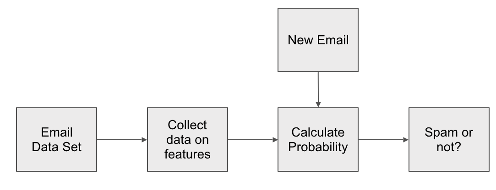
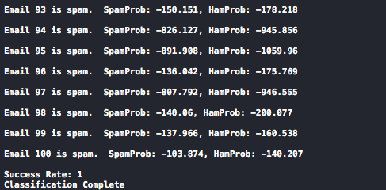
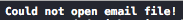

##Assignment  - Spam Classifier

###Overview
The overall goal of this assignment is to utilize supervised learning and C++ to create an application to classify emails as spam or ham (not spam).

Supervised learning is a form of machine learning in which a program makes predictions based on given training data. This training data will have a known result and the program must be able to determine what increases the likelyhood of this result.

The functional goal is to create a supervisied learning algorithm that includes two main algorithms, the training algorithm and the prediction algorithm. The training algorithm reads emails with a known classification stores what words were used in each email. The prediction algorithm reads a new unclassified email and calculates the probability of the email being spam or not. 

For more information on these algorithms check:

* **Video Lecture:** 

<video width=75% controls>
	<source src="Spam_Classifier.mp4" type="video/mp4">

This program will require knowledge on how to use [maps](http://www.cplusplus.com/reference/map/map/map/) and [vectors](http://www.cplusplus.com/reference/vector/vector/).

This program will also require knowledge on [reading files](http://www.cprogramming.com/tutorial/lesson10.html)

###Function Requirements

The following requirements are an overview of what is expected of you in this assignment. More details on how to implement the solution can be found in the Technical Requirements section.

* Create 4 functions with the following function prototypes: 
	* `bool trainingAlgorithm(string filePathHam, string filePathSpam);`
	* `void processData(ifstream &dataFile, int &count, map<string, int> &dataBase);`
	* `bool predictionAlgorithm(string emailFilePath);`
	* `double calcProbability(ifstream &emailFile);`
* Create 4 global variables
	* `map<string, int> spamWords;`
	* `map<string, int> hamWords`
	* `int spamCount = 0;`
	* `int hamCount = 0;`
	

###Getting Started

1. **Download** the three text files:
	* [hamEmails.txt](hamEmails.txt)
	* [spamEmails.txt](spamEmails.txt)
	* [testEmails.txt](testEmails.txt)
2. Create a new project and name your .cpp file `main.cpp`
3. Create include the necessary header files.
	* Note that must include `<map>` and `<vector>` in order to use the `map` and `vector` data types
	* Include `<fstream>` for reading the files
	* Include `<cmath>` for logarithm calculations
	* Include any other necessary header files
 

###Technical Requirements

This section will explain the details of how to complete this assigment. This assigment is not being unit tested using the **Catch** framework.

#### Function Descriptions

**`bool trainingAlgorithm(string filePathHam, string filePathSpam)`**

* `filePathHam` and `filePathSpam` should be file paths to the `hamEmails.txt` and `spamEmails.txt` files
* Uses ifstream to attempt to open files at `filePathHam` and `filePathSpam`. 
	* If unable to do so it prints out an error and returns false
	* If successful, it calls the `processData()` function twice (once for spam and once for ham) then returns true

  
**`void processData(ifstream &dataFile, int &count, map<string, int> &dataBase)`**

Note: The text files each have multiple emails each separated by two '@' symbols. 

* **Parameters**
	* `ifstream &dataFile`: Training data file. **This is not the file path!** Pass in Either the ham or spam `ifstream` variable.
	* `int &count`: Keeps track of number of emails in the dataset. Pass in either `spamCount` or `hamCount`.
	* `map<string, int> &dataBase`: Used to store words and number of occurances. Pass in either `spamWords` or `hamWords`.

* **Function**
	* You will need 2 `string` variables, one for the current email line, and one for the current email word (explained later)
	* You will need a `vector<string>` bariable to store what words have appeared in the current email 
	* Loop through each line of the text file using `while(getline(...))`
		* Loop through each character in the line (You cannot loop through words in a string but you can loop through characters and reconstruct the words one character at a time)
			* There are three cases (not the switch kind) to look for when looking at a character
				* Have you hit the end of the email? (Are the current and previous characters both '@')
					* Clear the `vector<string>` variable
					* Clear the word variable
					* Increment `count`
				* Have you hit the end of a word? (Is the character a space and the word variable not empty?)
					* Has the word appeared in this email before? [(How to search a vector)](http://www.cplusplus.com/reference/algorithm/find/)
						* Is the word already in `dataBase`?  [(How to search a map)](http://www.cplusplus.com/reference/map/map/find/)
							* Either increment the value already in `dataBase` or add the word to `dataBase`
							* Add the word to the `vector<string>`
				* Is the character alphanumeric? (Use the isalnum() function)
					* Convert the character to lowercase [(toLower()](http://www.cplusplus.com/reference/cctype/tolower/)) and add it to the word `string` variable

  
 **`bool predictionAlgorithm(string emailFilePath)`**
 
* `emailFilePath` should be the file path to the `testEmails.txt` file. 
* Uses ifstream to attempt to open `emailFilePath`
	* If unable to do so, it prints out an error and return false
	* If susscessful, it calls the `calcProbability()` function, prints out the return value, then returns true

  
**`double calcProbability(ifstream &emailFile);`**

Calculates the probabilities of the emails in `emailFile` being spam or not and prints out the prediction. Returns the success rate.

Note: There are 100 emails. The first 50 are ham and the second 50 are spam. 

* **Function**
	* Necessary variables
		* 2 `double` variables (One for spam probability one for ham probability)  
		* 2 `string` variables (One for current line and one for current word. See `processData()` function)
		* 1 `vector<string>` variable (For previously appeared words. See `processData()` function)
		* 3 `int variables` (One for word count, one for email count and one to count the number of successful predictions)
	* Use the instructions from the `processData()` function to loop through each line and word in the file. (The file structure is the same)
	* Use the instructions from the video lecture to calculate the probability (Make sure to search `spamWords` and `hamWords` before trying to access a word that isn't there)
	* At the end of an email, make sure to increment the email count, and reset the word count.
	* Print out the Prediction for each email as shown in the **Program Output** section below. Increment success count variable if the prediction is correct. (Remember that the first 50 emails are ham and second 50 are spam)
	* Make sure to avoid integer division when calculating the success rate.

If you implemented your code correctly, you should have a success rate of 1.  
	
  

###Program Output

Include these screenshots in your submission

***Sample Output 1: Successful Execution***

***Sample Output 2: Unable to open hamFile.txt***

***Sample Ouput 3: Unable to open spamFile.txt***
 

***Sample Output 4: Unable to open testEmails.txt***

	

